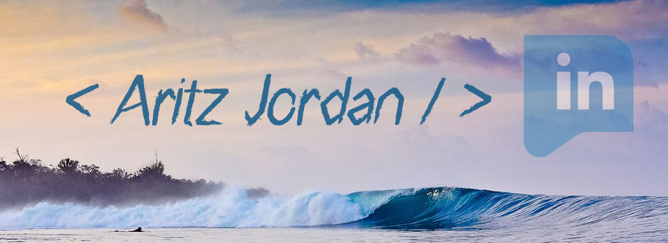

## Hi there ! 

### Thanks for visiting! 🤙

This is the place where I opensource stuff and try not to break many things 🤣

I'm continuously self-learnerning and I'm currently software engineering student at [42 School](https://www.42urduliz.com/) 

I am also a technology enthusiast and gadget freak. Always up to date on different kind of devices and learning something new.
My current goal is to deepen my knowledge in software engineering 💻 especially in cybersecurity and AI 🤖.

Here are some of my achievements and interests:

* 🎓  Higher Technician in Production of Audiovisual Projects and Shows
* 🎥  worked as local news camera operator
* ✏️  designed a Wordpress webpage and marketing plan for a natural cosmetics brand
* 🆘  worked as beach lifeguard for 6 years where I acquired a lot of teamwork experience
* 🏄‍♂️  surfing and bodyboarding
* 🌎  languages, travelling and new cultures
* 🐾  animals
.

	` If you are 42 cadet: feel free to reach me on Slack -> @ajordan- `
	
Or on any of this social networks:

 

	
---

<h3 align="center">
	I would be really happy if you star 🌟 my repositories if they were useful to you !
</h3>
